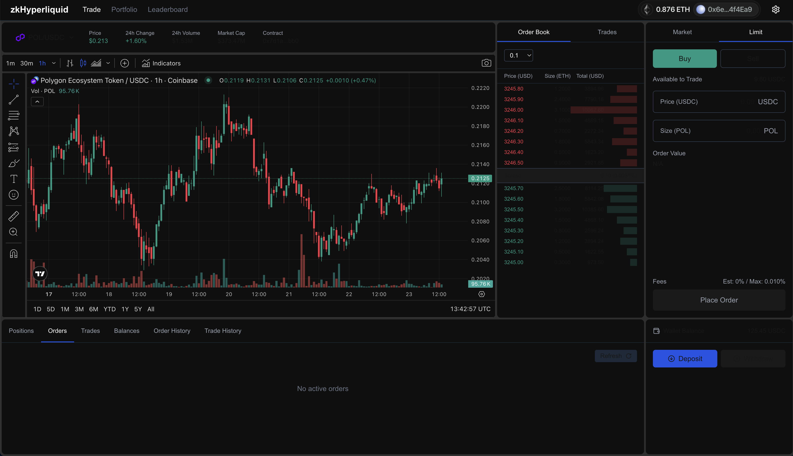

# zkHyperliquid

[](https://www.typescriptlang.org)
[](https://www.rust-lang.org)
[](https://opensource.org/licenses/MIT)

zkHyperliquid is a platform that leverages zero-knowledge proofs and the Vapp framework to create a secure, high-performance trading platform with cross-chain interoperability via AggLayer.



## Key Features

- Secure, verifiable transactions via zero-knowledge proofs
- High-throughput, low-latency trading environment
- Cross-chain interoperability through AggLayer integration
- Resistance to front-running and other common DeFi vulnerabilities
- Trustless order matching with cryptographic verification

## Project Structure

```
.
├── ui/                    # Frontend application
├── server/                # Backend server
│   └── src/               # Source code
│       ├── api/           # REST API endpoints for orders and users
│       ├── block/         # Block creation and database management
│       ├── engine/        # Order matching engine and mempool
│       ├── oracle/        # Price oracle integration
│       ├── sender/        # Transaction sender services
│       └── user/          # User management and authentication
└── contract/              # Foundry-based Solidity smart contracts
    ├── src/               # Contract source code (RollupBridge)
    ├── script/            # Deployment scripts
    ├── test/              # Contract test files
    └── lib/               # Contract dependencies
```

## How to run?

### Run the server

The server is a Rust application that runs on port 3000.

```bash
cd server
cargo run --release
```

### Run the UI

The UI is a Next.js application that runs on port 3001.

```bash
cd ui
bun install
bun dev --port 3001
```

## License

This project is licensed under the MIT License. See the [LICENSE](LICENSE) file for details.
